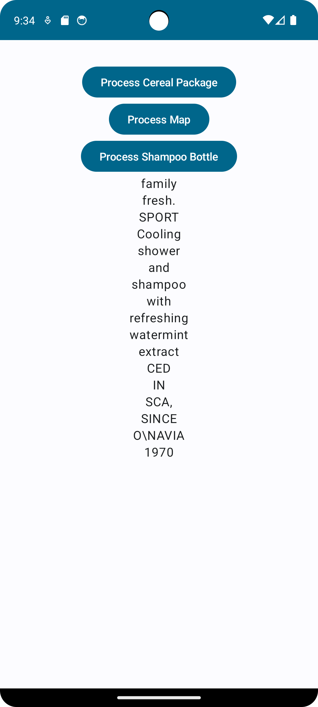

# MLKit-ex8
Maskininlärning med MLKit - Uppgift 8

## Problem
Utgå från veckans exempelprojekt. Lägg till tre knappar som väljer tre olika bilder med text du lagt till i projektet. Visa texten från bilden på skärmen.
Publicera på github och ange länk nedan.

## Resultat

